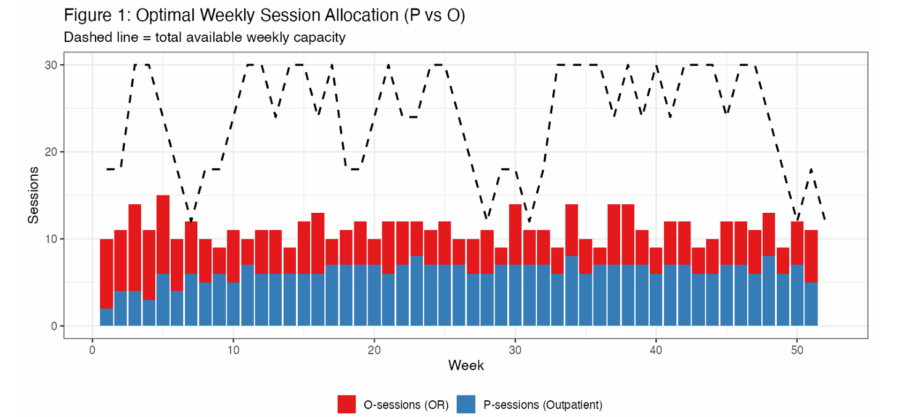
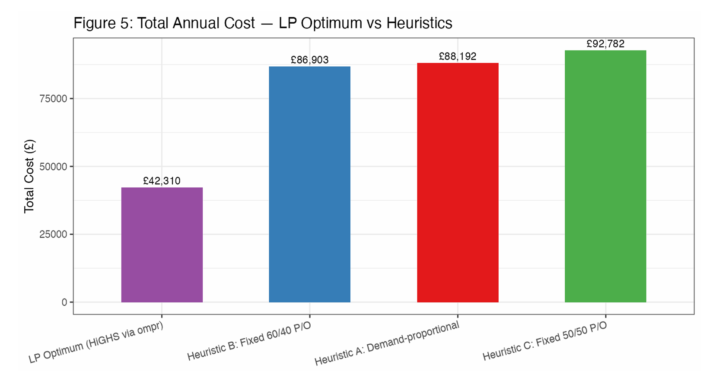

# Hospital Ophthalmology Scheduling: A 52-Week LP Optimisation

**A Linear Programming model in R and Excel that schedules a hospital ophthalmology department across 52 weeks under a Markov patient-flow model, cutting annual cost by 54% versus the standard scheduling rule.**

Hospitals schedule scarce clinician sessions weeks ahead, under uncertain demand, where untreated patients cascade into future workload. This project models that full dynamic and finds the cost-optimal weekly allocation of outpatient versus operating-room sessions, saving over £50,000 a year against the baseline.

> **Note:** this was a group project (Group B, six members) for the Data-Driven Decision-Making module. My contribution was the **Excel patient-flow model, the Markov transition-matrix verification, and the P2/P3 demand propagation logic**. The repository is shared as part of my portfolio with that scope made clear; full team credits are in the report.

---

## Business problem

Primazicht Hospital's ophthalmology department must decide, two weeks in advance, how many clinician sessions to allocate to outpatient clinics (P) versus operating-room work (O), across a 52-week horizon. Capacity swings seasonally (12 to 30 sessions a week), patients who aren't treated on time incur escalating penalties, and, critically, untreated patients cascade forward into future demand through a Markov patient-flow model. A fixed rule cannot cope with this. The goal: meet demand at minimum total annual cost.

## Approach

The project combines an Excel simulation baseline with a Linear Programming optimum:

- **Model the patient flow (Excel):** built a 52-week patient-flow simulation with a Markov chain across four patient states, carry-forward logic for delayed patients, and a quadratic lateness penalty reflecting escalating clinical harm. This established the baseline cost of the current 50/50 rule.
- **Propagate demand (Markov):** derived weekly P2 and P3 demand by applying a verified six-transition, eight-lead-time probability matrix to treated-patient volumes, so future demand correctly depends only on patients actually treated.
- **Optimise (LP in R):** formulated a Linear Programme with two-stage booking (plan two weeks ahead, then adjust via cancellations and switches), strict clinical priority ordering, capacity and backlog constraints, and a linearised delay penalty. Solved with the HiGHS solver via OMPR.
- **Stress-test (sensitivity analysis):** compared the LP optimum against three heuristic scheduling rules and tested robustness to cost, capacity, and demand shocks.
- **Tools:** R (`ompr`, `ROI.plugin.highs`, `tidyverse`), Excel (macro-enabled patient-flow model).

## Key findings

- **The LP optimum reached a total annual cost of £42,310, a 54% saving (over £50,000) against the baseline 50/50 scheduling rule.**
- **The saving comes from insight, not brute force:** the Markov cascade generates far more outpatient (P) demand than operating (O) demand, so a fixed equal split systematically under-serves P and creates avoidable delays. The optimum settles near a 56.5% P split, but adjusts week by week.
- **Clinical priority is protected:** the model treats 96.9% of operating-room patients and 98.7% of first-visit outpatients on time, concentrating the unavoidable delays in the lowest-urgency group.
- **Booking cost dominates:** in the optimal plan, 97% of cost is session booking and only 3% is lateness penalty, meaning the model nearly eliminates costly patient delays.
- **All three heuristic rules fall short** by £44,000 to £50,000, confirming that no fixed split can match dynamic weekly optimisation.
- **Holiday weeks are the key cost lever:** sensitivity analysis shows constrained low-capacity weeks drive most avoidable cost, pointing to where the hospital should invest.

## Why this matters for operations and supply chain

This is prescriptive optimisation on a genuinely dynamic system: demand in one period depends on decisions in earlier periods, exactly the structure of inventory, production, and capacity planning in supply chains. Multi-period allocation under uncertainty, carry-forward backlog, two-stage decisions with recourse, and cost-versus-service trade-offs are core operations research problems. The LP-with-solver and Markov-demand approach here transfers directly to demand planning and capacity optimisation.

## Visuals

The report contains the full set of figures. Two highlights:

*The optimal P versus O session mix each week, tracking against fluctuating available capacity.*

*The LP optimum against three fixed-rule heuristics: dynamic optimisation is far cheaper than any static split.*

## Repository contents

| File | Description |
|------|-------------|
| `pzh_ophthalmology_lp.R` | Full R model: Markov demand propagation, LP formulation, HiGHS solve, sensitivity analysis, and visualisations |
| `PZH_patient_flow_model.xlsm` | The Excel patient-flow simulation and baseline model (macro-enabled) |
| `PZH_Ophthalmology_Optimisation_Report.pdf` | Full group report: problem definition, model development, LP formulation, sensitivity analysis, and recommendations |
| `session_allocation.png` / `lp_vs_heuristics.png` | Key visuals |

## Reproducing this

Place `Primazicht--D3M-2026--A2.xlsm` in the same folder as the R script (it holds the case data on the "Case Data" sheet), then run `pzh_ophthalmology_lp.R`. In RStudio the working directory is auto-detected; otherwise set it with `setwd()` at the top. Required packages are listed near the top of the script.

> *Note: the case data was provided for coursework. The model is general and reproducible with any comparable two-stage scheduling problem with Markov demand dynamics.*
